# Create the prometheus data source
1. select Connection on the side pannel

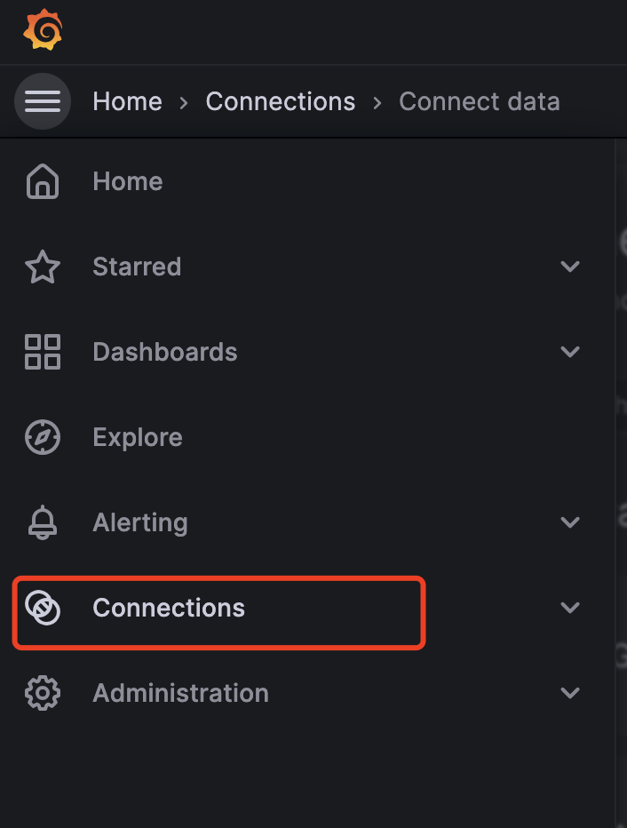

2. select data source

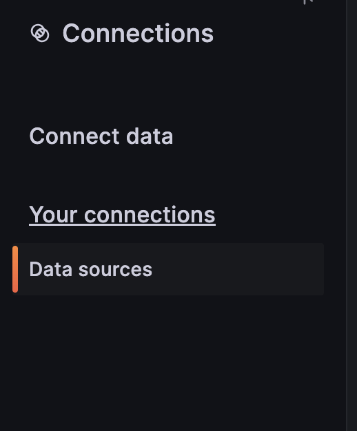

3. click Add new data source

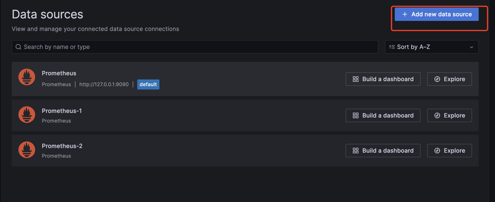

4. select prometheus

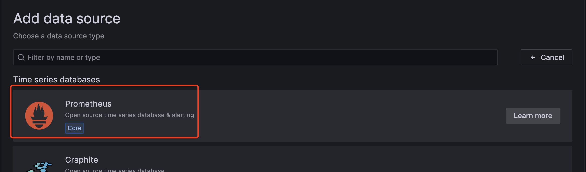

5. set the url to `http://127.0.0.1:9090` and the scrape interval to `1s`

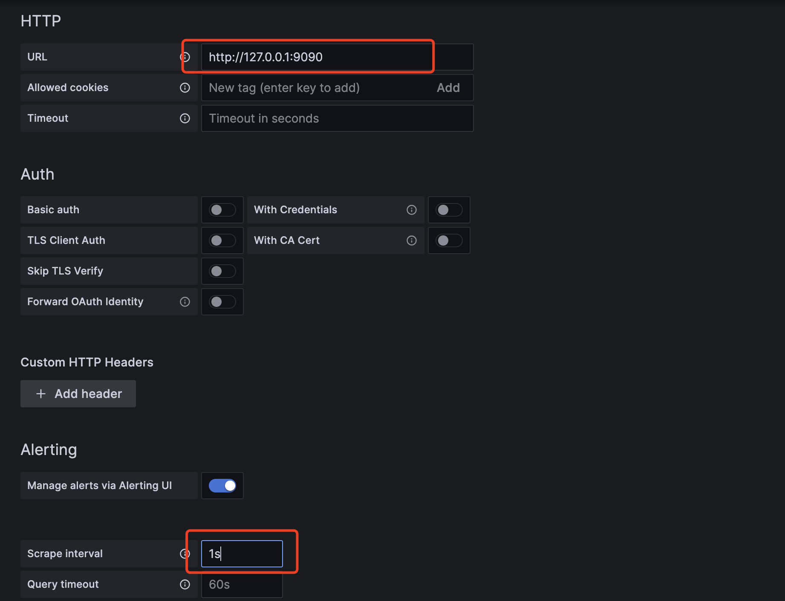

6. click save and test

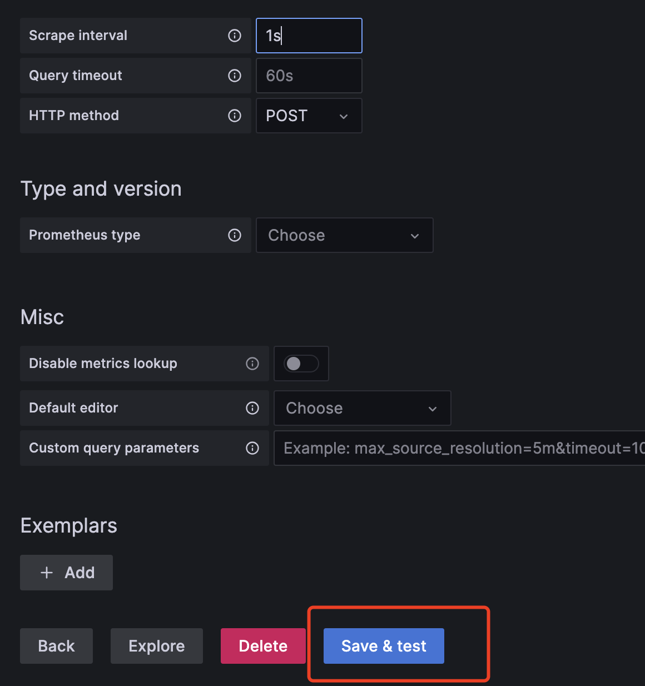

# Import grafana.json

1. select Dashboard from the side pannel

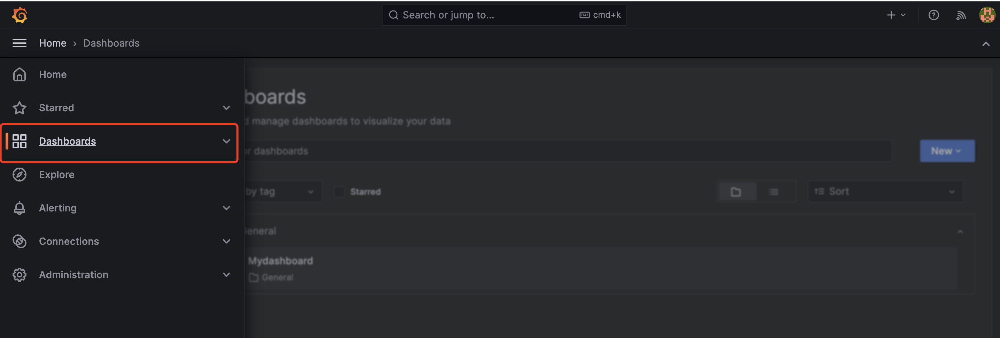

2. click the import button

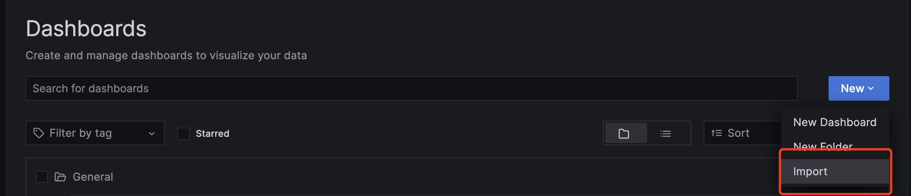

3. upload the `grafana.json` file in on the root directory

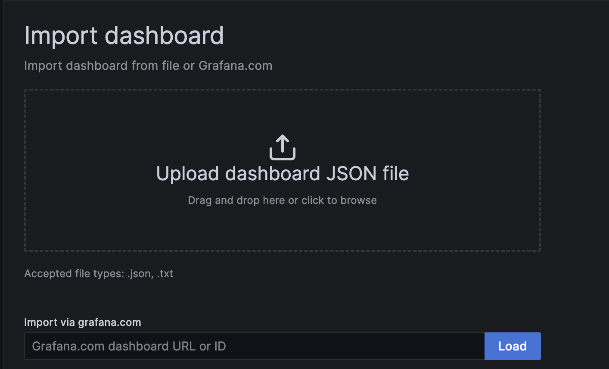

4. change the name, the uid, and the data source (that you create on the previous step)

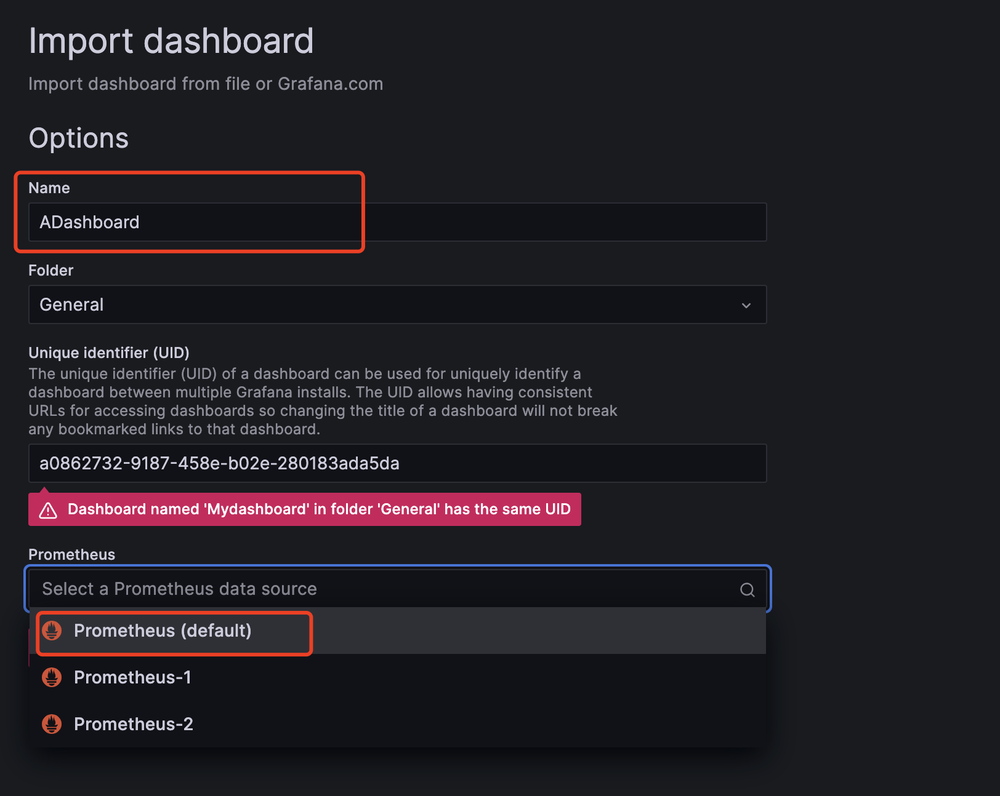

5. click import(overwrite)

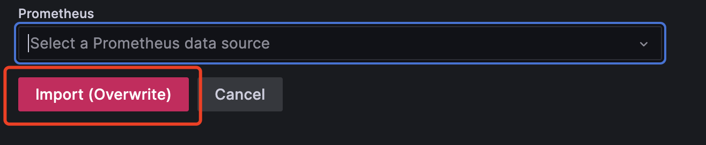
