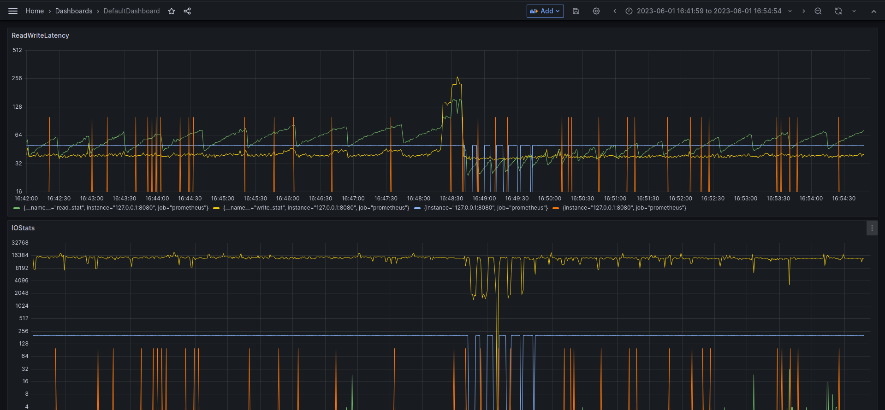

# rocksdb-profiler
This project aims to visualize the IO consumption and DB statistics so as to demonstrate the implicit connection between the IO and the operation latency.

## How to use

dependency:
1. [prometheus-cpp](https://github.com/jupp0r/prometheus-cpp)
2. docker

### install with cmake
```
mkdir build && cd build
cmake ..
sudo make install
```

### link with your project
simply use `find_package` in your `CMakeLists.txt`, then link with your executable.
```cmake
find_package(rocksprofiler REQUIRED)
...
target_link_libraries(your_executable rocksprofiler::rocksprofiler)
```

```cpp
#include "rocksdbprofiler/profiler.h"

int main() {
  rocksdb::Options options;
  rocksdb::EventListener* listener;
  rocksdb::Statistics* stats;
  rocksdbprofiler::CreateRocksDBProfiler((void**)&listener, (void**)&stats);
  options.listeners.emplace_back(listener);
  options.statistics.reset(stats);

  rocksdb::Status status = rocksdb::DB::Open(options, FLAGS_db_path, &db);
  rocksdbprofiler::StartRocksDBProfiler();
  // launch your workload
  rocksdbprofiler::StopRocksDBProfiler();
}
```

There are some examples in the `examples` directory.

### deploy the grafana dashboard
```
docker compose up -d
```

### Take a look at the dashboard
open your browser and go to `localhost:3000`, then login with `admin:admin`, you will see the dashboard.



If you are not familiar grafana, please refer to [this document](grafana-guide.md), or simply take a look at the [official document](https://grafana.com/docs/grafana/latest/dashboards/manage-dashboards/#export-and-import-dashboards).

## TODO
- [ ] unexpected segment fault at the end of the program 